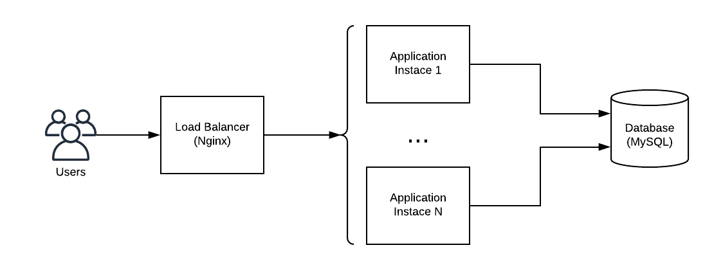

# Example of Using Prometheus for Monitoring

## TODO:
1. Connect application and MySQL
2. Add MySQL monitoring
3. Add custom metrics

## Goal

Show work configuration of two services and monitoring for them. 

Monitoring should allow to show:

* Application URL access via load balancer to show that application accessible for users
* Application System metrics CPU, Memory, DB connections, Thread pools.
* Application Business metrics - some custom metrics calculated on user requests programmatically
* DB availability
* Server resources metrics CPU, Memory, Disk (node_exporter)

Based on these metrics should be developed:

* Alarm triggers
* Graph dashboards

## Application & Infrastructure

We will have ToDo application which manage list of tasks. In order to store data it will use MySQL. Because it will be 
deployed in several instances we will use Nginx server as L7 (application/http layer) load balancer.

**NB:** It is not an AIM of this example to show: application architecture, scaling, load balancing and so on. Please do not
use presented configuration as some production ready examples. 



## Run example

Requirements (based on configuration, not required for monitoring it self):

* Gradle 6+
* Java 14+
* Docker
* Docker Compose


```bash
# Build JAR artifact to run in container
gradle clean bootJar 

# Create common network for two docker compose's if not exists
docker network ls | grep metrics-demo \
    || docker network create metrics-demo

# Run infrastructure: API documentation, Monitoring, DB
docker-compose -f './docker-compose-inf.yml' -p demo-inf up -d --force-recreate

# Please wait here until infrastructure will be available (time to coffee? =)
 
# Run application: Instances, Load balancer
docker-compose -f './docker-compose-app.yml' -p demo-app up -d --force-recreate --build
```

**NB:** Start of demo application and infrastructure separated into different compose files because application
requires to have access to the mysql at start of the instances.

Dont forget to clean up your environment at the end 

```bash
docker-compose -f './docker-compose-inf.yml' -p demo-inf down
docker-compose -f './docker-compose-app.yml' -p demo-app down

docker network rm metrics-demo
```

## Show how it works 

### Application deployment

How works load balancer

```bash
# Send request each second via load balancer and show app.instance
watch -n1 curl localhost:8888/actuator/info
```

### Monitoring

* `http://localhost:9090/new/alerts` - current status of triggers
* `http://localhost:9090/new/targets` - targets status 
* `http://localhost:9090/new/graph` - graphs

```promenteus
sum by (instance) (
    rate(http_server_requests_seconds_count[5m])
)
```

### Alerts

Show URL monitoring alert:
```bash
docker stop demo-app_load-balancer_1
```

Call blackbox:
```bash
curl localhost:9115/probe?module=http_2xx&target=http://load-balancer/actuator/health
```

Show app instance monitoring alert:
```bash
docker stop demo-app_instance1_1
```

Restore:
```bash
docker restart demo-app_instance1_1
docker restart demo-app_load-balancer_1
```

Show blackbox exporter monitoring alert
```bash
docker stop demo-app_blackbox-exporter_1
```

Stop MySQL monitoring alert
```bash
docker stop demo-inf_db_1
```

Restore:
```bash
docker restart demo-inf_db_1
docker restart demo-app_blackbox-exporter_1
```

```bash
curl -X POST localhost:8888/command/tasks/broken
```

### Business Metrics

Initially we have two tasks:
```bash
curl localhost:8888/query/tasks | python -m json.tool
```

```bash
curl --header "Content-Type: application/json" \
    --request POST \
    --data '{ "id": "2384f927-5e2f-3998-8baa-c768616287f5" }' \
    localhost:8888/command/tasks/delete 
```

```bash
curl --header "Content-Type: application/json" \
    --request POST \
    --data '{ "title": "One more task" }' \
    localhost:8888/command/tasks/add 
```
